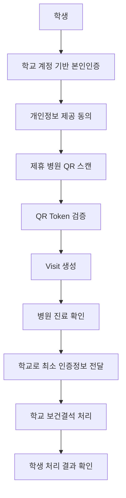
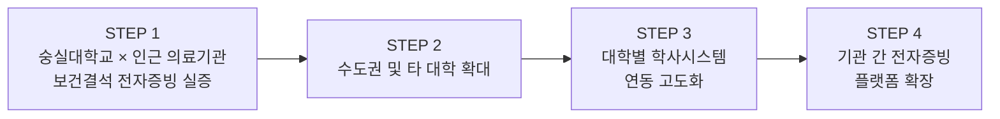
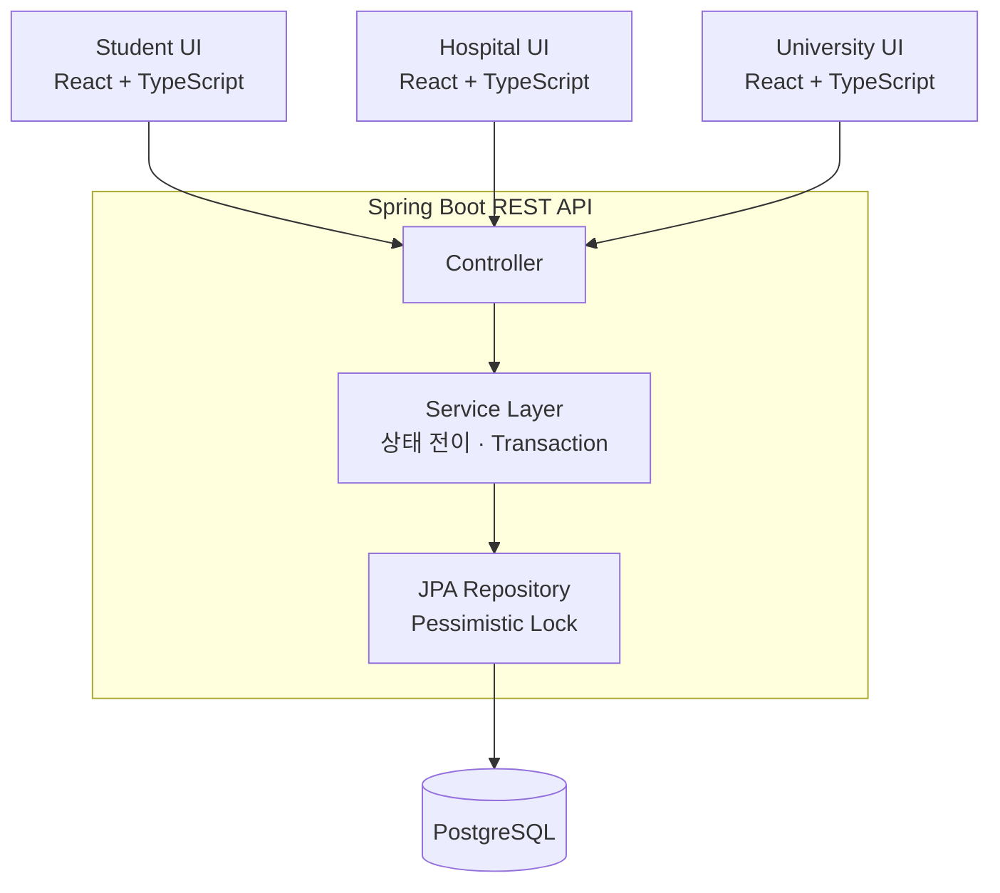
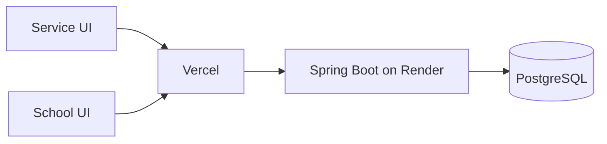
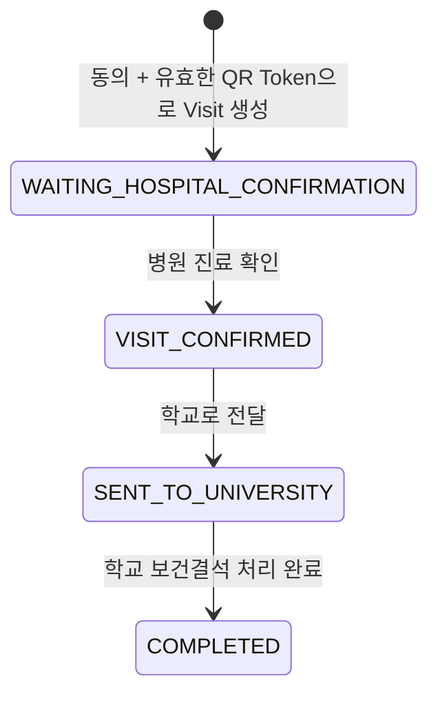
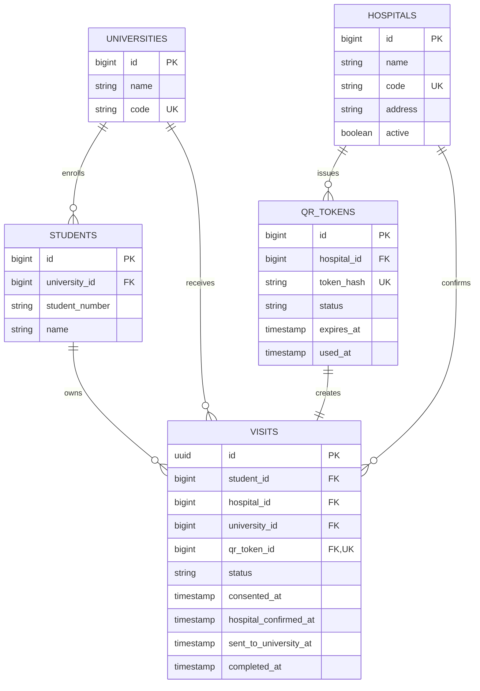

# AutoMedic

> 병원 진료부터 대학 보건결석 처리까지,<br>
> 증빙서류 없이 연결하는 기관 간 전자증빙 서비스

학생이 증빙서류를 직접 운반하는 과정을 없애고, 기관이 확인한 사실을 기관 간에 신뢰할 수 있는 형태로 전달합니다.

[Service UI](https://unithon-service.vercel.app) · [School UI](https://unithon-school.vercel.app) · [Demo Video](https://youtu.be/MmmwOKpubWY) · [Backend Health](https://unithon-backend.onrender.com/api/v1/health)

---

## 1. 프로젝트 소개

현재 대학의 보건결석 신청은 다음과 같은 과정을 거칩니다.

```text
병원 진료 → 증빙서류 발급 → 비용 지불 → 촬영/PDF 변환
         → 대학 시스템 접속 → 파일 첨부 → 담당자 검증 → 승인
```

AutoMedic은 학생이 병원과 학교 사이에서 증빙자료를 직접 운반하는 과정을 줄입니다. 학생이 제휴 병원에서 진료받고 정보 제공에 동의하면, 병원은 진료 사실을 인증하고 학교에는 보건결석 처리에 필요한 최소 정보만 전달합니다. 최종 승인 권한은 기존과 동일하게 대학이 가집니다.

## 2. 문제 정의

| 관점 | 현재의 문제 |
| --- | --- |
| 학생 | 아픈 상태에서도 서류를 별도로 발급하고 비용을 지불한 뒤 촬영·변환·업로드해야 하며, 반려되면 다시 제출해야 합니다. |
| 대학 | 이미지와 PDF를 사람이 직접 확인하고 위·변조 가능성을 검토하며, 반려와 재제출을 반복 처리합니다. |

병원은 이미 학생의 진료 사실을 알고 있고 대학은 그 사실을 확인하고 싶지만, 현재는 학생이 두 기관 사이에서 정보를 직접 운반하는 구조입니다.

## 3. AutoMedic의 해결 방식



서류의 온라인 제출 화면을 하나 더 만드는 대신, 학생의 동의를 바탕으로 병원에서 확인된 사실을 학교로 직접 전달하는 흐름을 구현했습니다.

## 4. 개인정보 최소 전달 원칙

학교의 Visit 조회 응답에는 현재 다음 정보만 포함됩니다.

```text
visitId, studentName, studentNumber, hospitalName, status,
hospitalConfirmedAt, sentToUniversityAt, createdAt
```

반면 학교에 전달하지 않는 정보는 다음과 같습니다.

```text
진단명, 처방전, 상세 진료내용
```

> AutoMedic은 진료 내용 자체를 학교에 전달하는 서비스가 아니라, 학생이 실제 제휴 의료기관에서 진료를 받았다는 사실을 검증하여 전달하는 서비스입니다.

## 5. Business Model

AutoMedic은 대학이 구매하고 학생이 무료로 이용하며 의료기관이 연계되는 **B2B2C SaaS** 모델을 지향합니다.

| 구분 | 대상 및 모델 |
| --- | --- |
| 구매 고객 | 대학 |
| 이용자 | 학생 - 무료 이용 |
| 연계기관 | 의료기관 - 간편 인증 포털 무료 제공 |
| 시범 운영 | 대학당 학기 기준 약 500만 원 |
| 정식 도입 | 대학 규모와 처리 건수에 따라 연간 약 1,500~2,000만 원 |
| 초기 연동 | 학사시스템 연동 범위에 따라 약 500~1,000만 원 |

가격은 사업화 가설이며 실제 계약에서는 대학 규모, 처리 건수, 연동 범위에 따라 달라질 수 있습니다.

## 6. 시장 진입 및 확장 전략



장기적으로 봉사활동, 인턴십, 교육 수료, 자격증 등 개인이 한 기관의 사실을 다른 기관에 다시 증명해야 하는 영역으로 확장합니다.

> 장기 목표는 기관이 이미 보유한 사실을 개인이 서류로 다시 증명하지 않아도 되는 기관 간 전자증빙 플랫폼입니다.

---

## 7. 핵심 기능

### 학생

- 학교 정보 기반 학생 본인인증
- 개인정보 제공 동의
- 카메라 기반 병원 QR 스캔과 Token 검증
- 동의 정보를 포함한 Visit 생성
- Visit 처리 상태 및 실제 API 기반 최근 처리 내역 확인
- 모바일 중심의 인증·동의·처리 화면

### 병원

- Mock 병원 로그인과 `sessionStorage` 기반 로그인 유지
- 서버 QR Token 발급과 `qrcode.react` 기반 실제 QR 이미지 생성
- 병원별 Visit 목록 조회 및 상태 필터링
- 진료 확인 후 학교 전달 처리
- 화면 진입 시 즉시 조회, 2.5초 polling, 수동 목록 갱신
- 중복 요청과 unmount 이후 상태 변경 방지

### 학교

- u-SAINT 스타일 Mock 로그인과 학생 API 인증
- 학교로 전달된 Visit 목록 조회
- 보건결석 신청 및 처리 완료
- 실제 API 응답의 학생 이름·학번 표시
- 시간표, 성적, 등록금 Mock UI

## 8. System Architecture





Service UI는 학생과 병원 화면을 제공하고, School UI는 대학 학사 화면을 담당합니다. 두 Vite 애플리케이션은 공통 Spring Boot REST API와 통신합니다.

## 9. 핵심 Backend Flow

Visit은 실제 코드의 네 상태를 순서대로 거칩니다.



| 상태 | 의미 |
| --- | --- |
| `WAITING_HOSPITAL_CONFIRMATION` | 학생 동의와 QR 검증을 마치고 병원 확인을 기다리는 상태 |
| `VISIT_CONFIRMED` | 병원이 해당 Visit의 진료 사실을 확인한 상태 |
| `SENT_TO_UNIVERSITY` | 학교 조회·처리 대상으로 전달된 상태 |
| `COMPLETED` | 학교가 보건결석 처리를 완료한 상태 |

## 10. 핵심 구현 포인트

### 10.1 상태 전이 검증

병원 확인, 학교 전달, 학교 완료는 각각 기대하는 이전 상태에서만 실행됩니다. Service Layer가 Visit 상태와 병원·학교 소속을 검증하며, 순서가 맞지 않거나 다른 기관의 Visit을 처리하려는 요청은 `409 Conflict`로 차단합니다.

```text
WAITING_HOSPITAL_CONFIRMATION만 병원 확인 가능
VISIT_CONFIRMED만 학교 전달 가능
SENT_TO_UNIVERSITY만 학교 완료 가능
```

### 10.2 QR Token

- 병원 ID로 직접 Visit을 만들지 않고 서버가 32바이트 난수 Token을 발급합니다.
- 원문 Token은 발급 응답으로만 전달하고 DB에는 SHA-256 해시를 저장합니다.
- Token 유효시간은 30분이며 상태는 `ACTIVE`, `USED`, `EXPIRED`로 관리합니다.
- Visit 생성 시 학생 동의 여부와 Token 상태·만료 시간을 다시 검증합니다.
- 생성에 성공하면 Token을 즉시 `USED`로 변경하고 사용 시각을 기록합니다.
- 이미 사용된 Token은 `409 Conflict`, 만료 Token은 `400 Bad Request`로 거부합니다.
- 병원 화면은 `qrcode.react`로 Token을 실제 QR 이미지로 만들고 학생 화면은 `jsQR`로 카메라 영상을 해석합니다.

현재 MVP에는 별도의 전자서명 체계가 구현되어 있지 않으며, QR Token 자체를 전자서명으로 표현하지 않습니다.

### 10.3 중복 처리 및 동시성 제어

상태 변경 Service에는 `@Transactional`을 적용했습니다. QR Token 사용 시 `QrTokenRepository`, Visit 상태 변경 시 `VisitRepository`가 `PESSIMISTIC_WRITE` 락으로 대상 행을 조회합니다. 동일 Token 사용이나 동일 Visit 변경 요청이 동시에 들어와도 트랜잭션 안에서 한 요청씩 상태를 검증하도록 구성했습니다.

### 10.4 Polling 기반 병원 Visit 동기화

병원 대시보드는 WebSocket이 아닌 **2.5초 polling**으로 목록을 동기화합니다.

- 화면 진입 즉시 Visit 목록 조회
- 2.5초 간격 자동 갱신
- 이전 요청 진행 중 중복 호출 방지
- 컴포넌트 unmount 시 interval 제거
- unmount 이후 state 변경 방지
- 선택한 Visit의 최신 상태 동기화
- 전체 페이지 reload 없는 수동 목록 갱신
- 목록 조회 오류와 처리 오류 분리

### 10.5 환경변수 기반 배포

Frontend API client는 `VITE_API_BASE_URL`을 사용하고 값이 없을 때만 `http://localhost:8080`을 기본값으로 사용합니다.

| 대상 | 환경변수 | 용도 |
| --- | --- | --- |
| 공통 Frontend | `VITE_API_BASE_URL` | Spring Boot API 주소 |
| Service UI | `VITE_HOSPITAL_ID` | 시연 병원 ID |
| Service UI | `VITE_UNIVERSITY_CODE` | 학생 인증 대학 코드 |
| School UI | `VITE_UNIVERSITY_ID` | 대학 Visit 조회 ID |
| Backend | `DATABASE_URL` | PostgreSQL JDBC URL |
| Backend | `DATABASE_USERNAME` | DB 사용자 |
| Backend | `DATABASE_PASSWORD` | DB 비밀번호 |
| Backend | `FRONTEND_URL` | CORS 허용 origin 목록 |
| Backend | `PORT` | 서버 포트, 기본값 `8080` |

Backend는 호환용으로 `DB_URL`, `DB_USERNAME`, `DB_PASSWORD`도 fallback으로 읽습니다. 운영 비밀값은 저장소에 커밋하지 않습니다.

## 11. Tech Stack

| 영역 | 기술 |
| --- | --- |
| Frontend | React 19, TypeScript 5.7, Vite 8, Tailwind CSS 4 |
| QR | `jsQR` 1.4, `qrcode.react` 4.2 |
| Backend | Java 21, Spring Boot 3.3, Spring Web, Spring Data JPA, Bean Validation, Gradle |
| Database | PostgreSQL 16, Hibernate/JPA |
| Deployment | Vercel, Render, Docker |
| Local development | Docker Compose |

## 12. Repository Structure

```text
unithon/
├── frontend/
│   ├── service/          # 학생·병원 React UI, QR 스캔/생성
│   └── school/           # u-SAINT 스타일 대학 React UI
├── backend/
│   └── spring-server/    # Spring Boot REST API와 비즈니스 로직
├── docker-compose.yml    # 로컬 PostgreSQL 16
└── README.md
```

## 13. 주요 API

실제 Controller의 `/api/v1` Endpoint만 정리했습니다.

| Category | Method | Endpoint | Description |
| --- | --- | --- | --- |
| Auth | `POST` | `/api/v1/auth/students/verify` | 대학 코드·학번·이름으로 학생 확인 |
| Auth | `POST` | `/api/v1/auth/students/login` | School UI의 Mock 학생 로그인 |
| QR Token | `POST` | `/api/v1/hospitals/{hospitalId}/qr-tokens` | 병원용 1회성 QR Token 생성 |
| QR Token | `GET` | `/api/v1/qr-tokens/{token}` | QR Token 유효성 및 병원 확인 |
| Visit | `POST` | `/api/v1/visits` | 동의·학생·QR Token을 검증하고 Visit 생성 |
| Visit | `GET` | `/api/v1/visits/{visitId}` | 단일 Visit 조회 |
| Visit | `GET` | `/api/v1/students/{studentId}/visits` | 학생의 Visit 목록 최신순 조회 |
| Hospital | `GET` | `/api/v1/hospitals/{hospitalId}/visits` | 병원 Visit 목록 조회, 선택적 `status` 필터 |
| Hospital | `POST` | `/api/v1/hospitals/{hospitalId}/visits/{visitId}/confirm` | 병원 진료 확인 |
| University | `POST` | `/api/v1/visits/{visitId}/send-to-university` | 확인된 Visit을 학교로 전달 |
| University | `GET` | `/api/v1/universities/{universityId}/visits` | 대학 Visit 목록 조회, 선택적 `status` 필터 |
| University | `POST` | `/api/v1/universities/{universityId}/visits/{visitId}/complete` | 대학 보건결석 처리 완료 |
| Health | `GET` | `/api/v1/health` | 서버 상태 확인 |

## 14. Database



핵심 Entity는 `University`, `Student`, `Hospital`, `QrToken`, `Visit`입니다. 한 학생은 하나의 대학에 속하고, Visit은 학생·병원·대학·QR Token을 연결합니다. `qr_token_id`는 unique이므로 하나의 Token으로 두 개의 Visit을 만들 수 없습니다.

## 15. 실행과 배포

### 배포된 결과물

| Component | URL |
| --- | --- |
| Service UI | https://unithon-service.vercel.app |
| School UI | https://unithon-school.vercel.app |
| Backend | https://unithon-backend.onrender.com |
| Health Check | https://unithon-backend.onrender.com/api/v1/health |

Service UI, School UI, Health Check는 최종 README 작성 시점에 HTTP 200 응답을 확인했습니다. Render Free 인스턴스는 장시간 요청이 없으면 sleep 상태가 되어 첫 요청이 지연될 수 있습니다.

### 로컬 실행

```bash
# PostgreSQL
docker compose up -d
```

```bash
# Backend - Windows
cd backend/spring-server
gradlew.bat bootRun
```

```bash
# Service UI
cd frontend/service
npm install
npm run dev
```

```bash
# School UI
cd frontend/school
npm install
npm run dev
```

macOS/Linux에서는 Backend 실행 시 `./gradlew bootRun`을 사용합니다. 두 Frontend는 각각 별도 터미널에서 실행합니다.

### 배포 설정

| Project | Root Directory | Build Command | Output Directory |
| --- | --- | --- | --- |
| Service UI | `frontend/service` | `npm run build` | `dist` |
| School UI | `frontend/school` | `npm run build` | `dist` |
| Backend | `backend/spring-server` | Dockerfile build | Container port `8080` |

Render에는 PostgreSQL JDBC URL과 DB 계정, 두 Vercel origin을 포함한 `FRONTEND_URL`을 설정합니다. Health Check Path는 `/api/v1/health`입니다.

## 16. Demo

전체 시연 영상: **[2026 유니톤 9팀 덤벼라유니톤](https://youtu.be/MmmwOKpubWY)**

권장 시연 순서:

1. Service UI에서 학생 인증과 정보 제공 동의를 완료합니다.
2. 병원 화면에서 QR Token을 발급합니다.
3. 학생 화면에서 QR을 스캔해 Visit을 생성합니다.
4. 병원 화면에서 새 Visit을 확인하고 진료 완료·학교 전달을 처리합니다.
5. School UI에서 전달된 Visit을 조회하고 보건결석 처리를 완료합니다.
6. 학생 화면에서 실제 Visit 기반 처리 결과를 확인합니다.

## 17. MVP 범위와 향후 개선

### 현재 MVP - 구현 완료

- 학생 정보 기반 본인인증과 School UI의 Mock 로그인
- 정보 제공 동의와 동의 없는 Visit 생성 차단
- QR Token 생성·검증·만료·1회 사용 및 해시 저장
- 실제 QR 이미지 생성과 카메라 스캔
- Visit 생성과 네 단계 상태 전이
- 병원 Visit 조회·polling·진료 확인·학교 전달
- 학교 Visit 조회와 보건결석 처리 완료
- 학생의 실제 Visit 목록과 최근 처리 내역
- PostgreSQL 영속화, 상태 변경 Transaction과 비관적 락
- Vercel Frontend 및 Render Backend 배포

### 향후 개선 - 미구현

- 실제 대학 SSO와 학사시스템 API 연동
- 병원 EMR 연동
- 사용자·기관별 정식 인증 및 권한 관리
- QR Token 서명과 키 관리 등 보안 체계 강화
- 감사 로그와 운영 이력 고도화
- 연계 장애 자동 재시도 및 대체 증빙 fallback
- 개인정보·의료정보 관련 법률 및 운영 정책 검토
- 대학별 보건결석 기준과 자동 판정 규칙 설정
- 모니터링, 알림, CI/CD 및 운영 자동화

현재 MVP는 전체 서비스 흐름과 기술적 실현 가능성을 검증하기 위한 환경입니다. 실제 대학·의료기관 시스템과 직접 연동되었다고 표현하지 않으며, 향후 개선 항목은 구현 완료 범위와 분리합니다.

## 18. 프로젝트의 핵심 가치

### For Students

서류를 발급받고 촬영하고 제출하는 과정을 줄입니다.

### For Universities

반복적인 증빙 확인·반려·재제출 업무를 줄이고 검증 가능한 인증정보를 받습니다.

### For Hospitals

복잡한 시스템 구축 없이 학생 동의를 기반으로 필요한 진료 사실만 인증합니다.

---

AutoMedic은 보건결석을 시작점으로, 개인이 기관 사이에서 증빙서류를 운반하지 않아도 되는 흐름을 실험합니다.
